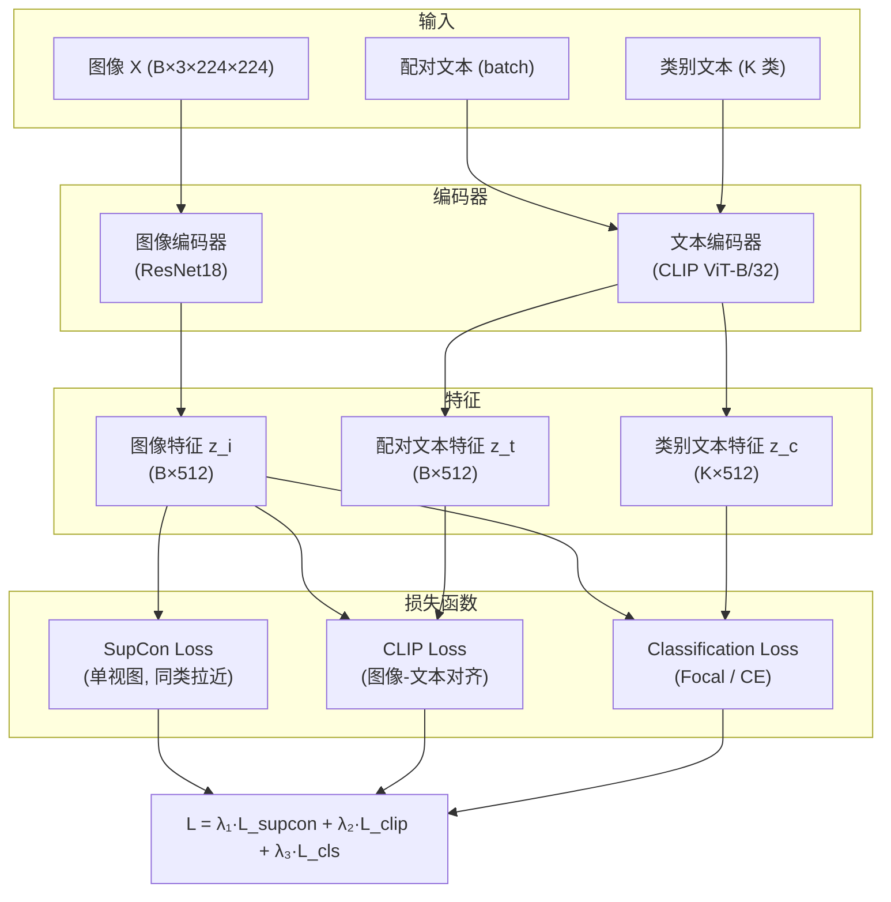
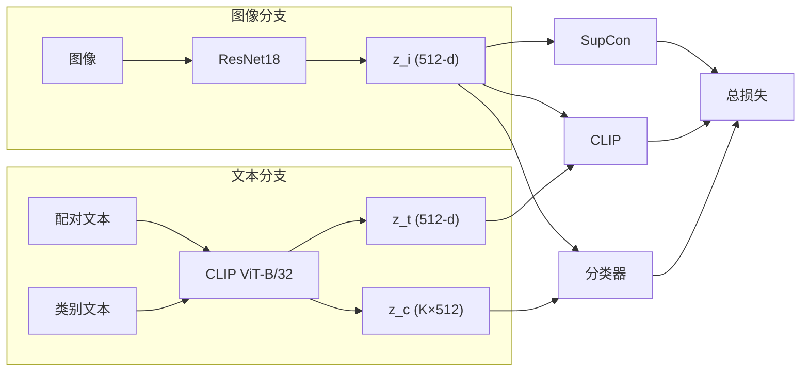

# SupCon-CLIP 模型架构图

## 流程图 (Mermaid)

可在支持 Mermaid 的编辑器中渲染（如 VS Code 插件、Typora、GitHub 等），或使用 https://mermaid.live 导出为 PNG/SVG。

## 简化框图 (左右双分支)

## 模块说明

| 模块 | 说明 |
|------|------|
| 图像编码器 | ResNet18，输出 512 维 L2 归一化特征 |
| 文本编码器 | CLIP ViT-B/32 文本塔，输出 512 维 |
| SupCon | 单视图有监督对比：正样本为 batch 内同类别样本 |
| CLIP Loss | 对称 CE(image→text, text→image)，温度 τ=0.07 |
| 分类 | 图像特征与 K 类文本特征相似度 → logits → Focal Loss |
