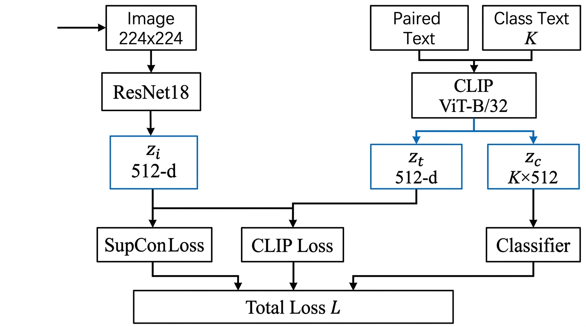
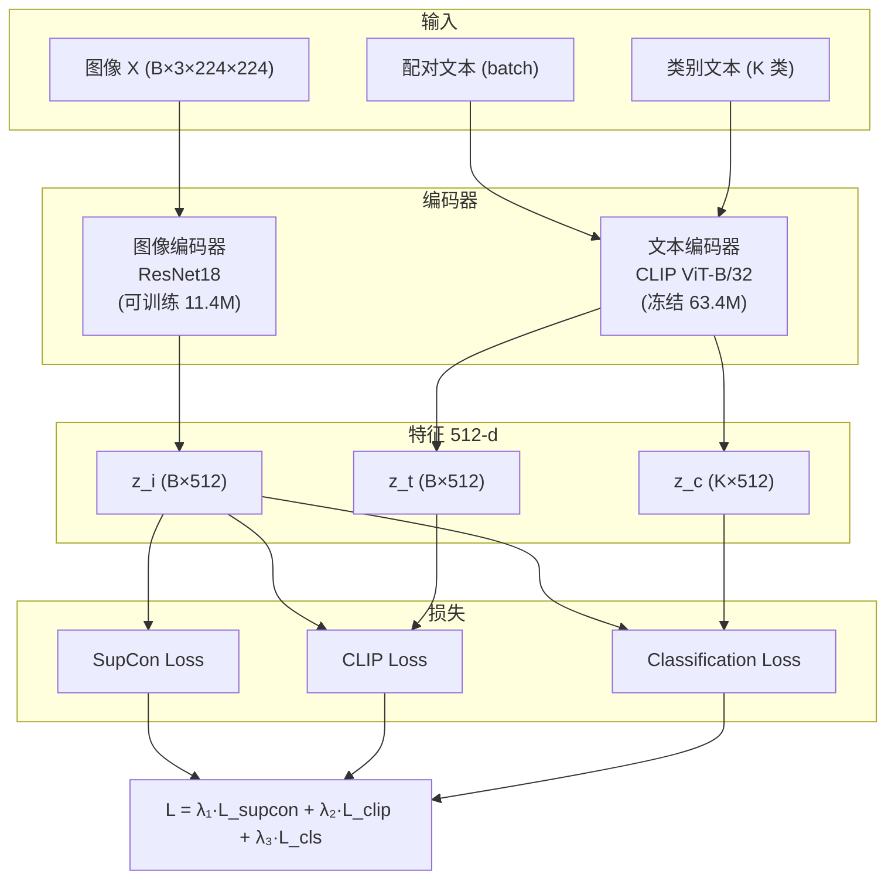
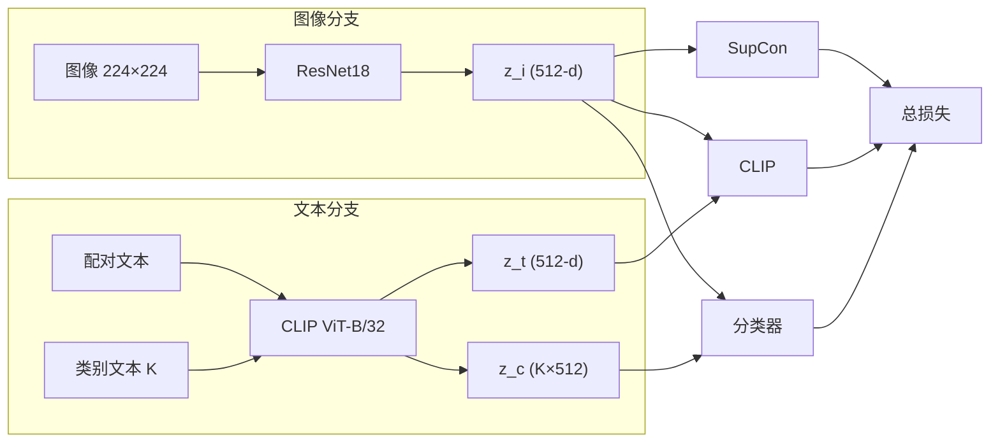

# ResNet18 + CLIP ViT-B/32 模型架构图

对应训练配置：`resnet18_clip_ViT-B_32`（见日志 `resnet18_clip_ViT-B_32_gpu9_20260305_151257.log`）

- **图像编码器**: ResNet18，可训练，约 11.4M 参数  
- **文本编码器**: CLIP ViT-B/32，冻结，约 63.4M 参数  
- **嵌入维度**: 512  
- **损失**: SupCon + CLIP + 分类（Focal/CE），温度 τ=0.07  

---

## 1. 总览流程图（自上而下）

在支持 Mermaid 的编辑器中打开，或复制到 [mermaid.live](https://mermaid.live) 导出 PNG/SVG。

---

## 2. 左右双分支简化图

---

## 3. 数据流与损失关系

| 输入       | 编码器        | 输出    | 参与损失     |
|------------|---------------|---------|--------------|
| 图像       | ResNet18      | z_i     | SupCon, CLIP, 分类 |
| 配对文本   | ViT-B/32      | z_t     | CLIP         |
| 类别文本   | ViT-B/32      | z_c     | 分类         |

- **SupCon**: 单视图有监督对比，batch 内同类别为正样本  
- **CLIP**: 对称 CE(image↔text)，τ=0.07  
- **分类**: z_i 与 z_c 相似度 → logits → Focal Loss  

---

导出为图片：将上述 Mermaid 代码粘贴到 https://mermaid.live 即可下载 PNG 或 SVG。
